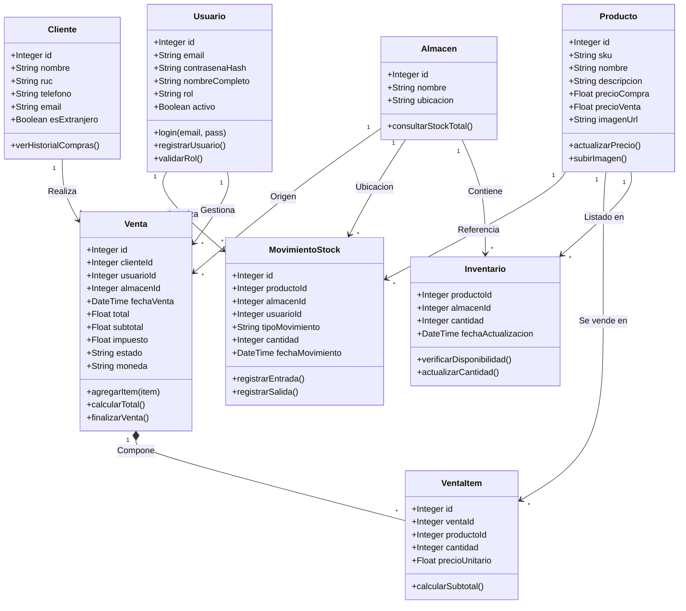

# 🍷 VinoVault

**Proyecto:** VinoVault: Aplicación web para gestión de stock y ventas de vinos.  
**Autor:** Vladimir De Andrade  

---

## 📝 Descripción

**VinoVault** es una aplicación **web full-stack** desarrollada con **React (Vite) + Node.js (Express)** y base de datos **PostgreSQL**, orientada a facilitar la gestión de inventario, control de ventas y registro de productos para vendedores o distribuidores de vinos.  

El sistema permite **registrar productos, controlar el stock, gestionar clientes, registrar ventas** y consultar el historial de movimientos.  
Está desarrollada íntegramente en **TypeScript**, garantizando un código más limpio, seguro y mantenible.

---

## ⚙️ Instalación y ejecución

### 🔹 1. Clonar el repositorio
```bash
git clone https://github.com/usuario/vino_stock_app.git
cd vino_stock_app
```

### 🔹 2. Instalar dependencias del frontend
```bash
cd frontend
npm install
```

### 🔹 3. Instalar dependencias del backend
```bash
cd ../backend
npm install
```

### 🔹 4. Configurar variables de entorno

Crear un archivo `.env` en la carpeta **backend** con los siguientes valores:

```env
PORT=5000
DB_HOST=localhost
DB_PORT=5432
DB_USER=postgres
DB_PASS=tu_contraseña
DB_NAME=vino_stock
JWT_SECRET=clave_secreta
EXCHANGE_API_KEY=tu_api_key
```

### 🔹 5. Crear la base de datos en PostgreSQL

Antes de ejecutar el backend, asegurate de crear la base de datos manualmente en PostgreSQL.  
Podés hacerlo desde **pgAdmin**, **DBeaver**, o la terminal de PostgreSQL:

```sql
-- 1. Limpieza inicial (Cuidado: borra todo si ya existe)
DROP TABLE IF EXISTS venta_items CASCADE;
DROP TABLE IF EXISTS ventas CASCADE;
DROP TABLE IF EXISTS movimientos_stock CASCADE;
DROP TABLE IF EXISTS inventario CASCADE;
DROP TABLE IF EXISTS usuarios CASCADE;
DROP TABLE IF EXISTS productos CASCADE;
DROP TABLE IF EXISTS clientes CASCADE;
DROP TABLE IF EXISTS almacenes CASCADE;

-- 2. Tablas Independientes (No dependen de otras)

CREATE TABLE almacenes (
    id SERIAL PRIMARY KEY,
    nombre VARCHAR(255) NOT NULL,
    ubicacion TEXT
);

CREATE TABLE clientes (
    id SERIAL PRIMARY KEY,
    nombre VARCHAR(255) NOT NULL,
    ruc VARCHAR(50),
    telefono VARCHAR(50),
    email VARCHAR(255),
    fecha_registro TIMESTAMP DEFAULT CURRENT_TIMESTAMP,
    es_extranjero BOOLEAN DEFAULT false
);

CREATE TABLE productos (
    id SERIAL PRIMARY KEY,
    sku VARCHAR(100) NOT NULL UNIQUE, -- El SKU debe ser único
    nombre VARCHAR(255) NOT NULL,
    descripcion TEXT,
    precio_compra NUMERIC(10,2),
    precio_venta NUMERIC(10,2),
    fecha_creacion TIMESTAMP WITH TIME ZONE DEFAULT NOW(),
    imagen_url VARCHAR(255)
);

CREATE TABLE usuarios (
    id SERIAL PRIMARY KEY,
    email VARCHAR(255) NOT NULL UNIQUE,
    contrasena_hash VARCHAR(255) NOT NULL,
    nombre_completo VARCHAR(255),
    rol VARCHAR(50) DEFAULT 'vendedor' NOT NULL,
    activo BOOLEAN DEFAULT true,
    fecha_creacion TIMESTAMP WITH TIME ZONE DEFAULT NOW()
);

-- 3. Tablas Dependientes (Tienen Foreign Keys)

CREATE TABLE inventario (
    producto_id INTEGER NOT NULL,
    almacen_id INTEGER NOT NULL,
    cantidad INTEGER DEFAULT 0 NOT NULL,
    fecha_actualizacion TIMESTAMP WITH TIME ZONE DEFAULT NOW(),
    -- Llave primaria compuesta
    PRIMARY KEY (producto_id, almacen_id),
    -- Relaciones
    CONSTRAINT fk_inventario_producto FOREIGN KEY (producto_id) REFERENCES productos(id) ON DELETE CASCADE,
    CONSTRAINT fk_inventario_almacen FOREIGN KEY (almacen_id) REFERENCES almacenes(id) ON DELETE CASCADE
);

CREATE TABLE movimientos_stock (
    id SERIAL PRIMARY KEY,
    producto_id INTEGER NOT NULL,
    almacen_id INTEGER NOT NULL,
    usuario_id INTEGER, -- Puede ser nulo si se borra el usuario
    tipo_movimiento VARCHAR(50) NOT NULL, -- Ejemplo: 'Entrada', 'Salida', 'Ajuste'
    cantidad INTEGER NOT NULL,
    fecha_movimiento TIMESTAMP WITH TIME ZONE DEFAULT NOW(),
    -- Relaciones
    CONSTRAINT fk_movimiento_producto FOREIGN KEY (producto_id) REFERENCES productos(id) ON DELETE SET NULL,
    CONSTRAINT fk_movimiento_almacen FOREIGN KEY (almacen_id) REFERENCES almacenes(id) ON DELETE SET NULL,
    CONSTRAINT fk_movimiento_usuario FOREIGN KEY (usuario_id) REFERENCES usuarios(id) ON DELETE SET NULL
);

CREATE TABLE ventas (
    id SERIAL PRIMARY KEY,
    cliente_id INTEGER,
    usuario_id INTEGER,
    almacen_id INTEGER,
    fecha_venta TIMESTAMP DEFAULT CURRENT_TIMESTAMP,
    moneda VARCHAR(3) DEFAULT 'USD',
    subtotal NUMERIC(10,2),
    impuesto NUMERIC(10,2),
    total NUMERIC(10,2) NOT NULL,
    estado VARCHAR(50) DEFAULT 'Completada',
    -- Relaciones
    CONSTRAINT fk_ventas_cliente FOREIGN KEY (cliente_id) REFERENCES clientes(id),
    CONSTRAINT fk_ventas_usuario FOREIGN KEY (usuario_id) REFERENCES usuarios(id),
    CONSTRAINT fk_ventas_almacen FOREIGN KEY (almacen_id) REFERENCES almacenes(id)
);

CREATE TABLE venta_items (
    id SERIAL PRIMARY KEY,
    venta_id INTEGER NOT NULL,
    producto_id INTEGER NOT NULL,
    cantidad INTEGER NOT NULL,
    precio_unitario NUMERIC(10,2) NOT NULL,
    -- Relaciones
    CONSTRAINT fk_items_venta FOREIGN KEY (venta_id) REFERENCES ventas(id) ON DELETE CASCADE, -- Si borro venta, borro sus items
    CONSTRAINT fk_items_producto FOREIGN KEY (producto_id) REFERENCES productos(id)
);

-- 4. Índices para mejorar rendimiento (Opcional pero recomendado)
CREATE INDEX idx_productos_nombre ON productos(nombre);
CREATE INDEX idx_ventas_fecha ON ventas(fecha_venta);
```

### 🔹 7. Iniciar el backend
```bash
npm run dev
```

### 🔹 8. Iniciar el frontend
```bash
cd ../frontend
npm run dev
```

---

## 🧩 Tecnologías y dependencias principales

### 🌐 **Frontend (React + Vite + TypeScript)**

| Categoría | Tecnología | Descripción |
|------------|-------------|--------------|
| Framework/Librería | **React** | Construcción de la interfaz y componentes dinámicos |
| Lenguaje | **TypeScript** | Tipado estático para un código más robusto |
| Estilo visual | **Material UI (MUI)** | Componentes de diseño moderno (botones, tablas, formularios) |
| Comunicación con backend | **Axios** | Peticiones HTTP hacia la API REST |
| Ruteo | **React Router DOM** | Navegación entre páginas (Login, Dashboard, Historial, etc.) |
| Estado global | **React Context API** | Manejo de usuario, tema y datos globales |
| Tokens | **jwt-decode** | Decodificación de JWT para obtener datos del usuario |
| Paquetería | **npm** | Gestión de dependencias del proyecto |

---

### ⚙️ **Backend (Node.js + Express + TypeScript)**

| Categoría | Tecnología | Descripción |
|------------|-------------|--------------|
| Entorno | **Node.js** | Ejecución del servidor |
| Framework | **Express.js** | Creación de la API REST |
| Lenguaje | **TypeScript** | Código más seguro y estructurado |
| Base de datos | **PostgreSQL** | Almacenamiento relacional de datos |
| ORM/Driver | **pg** | Conexión directa con PostgreSQL |
| Autenticación | **jsonwebtoken + bcryptjs** | JWT para sesión, bcrypt para contraseñas |
| Carga de archivos | **multer** | Subida de imágenes de productos |
| Peticiones externas | **axios** | Consultas a la API de tasas de cambio |
| Seguridad | **cors** | Control de acceso entre dominios |
| Configuración | **dotenv** | Variables de entorno |
| Paquetería | **npm** | Gestión de dependencias del backend |

---

## 🧾 Diagrama de Clases

## 🏗️ Arquitectura general del sistema

```
┌───────────────────────────┐
│     React (Vite + TS)     │
│     Material UI (MUI)     │
│  ────────────┬─────────── │
│    UI y lógica del cliente │
└──────────────┬────────────┘
               │
         Peticiones HTTP (Axios)
               │
               ▼
┌───────────────────────────┐
│  Node.js + Express (API)  │
│   Autenticación JWT, CRUD │
│   Gestión de imágenes     │
└──────────────┬────────────┘
               │
               ▼
┌───────────────────────────┐
│       PostgreSQL DB       │
│ Productos, Ventas, Stock  │
└───────────────────────────┘
```

---

## 🚀 Funcionalidades principales

- Autenticación segura con JWT.  
- Registro, edición y eliminación de productos.  
- Control dinámico del stock de vinos.  
- Registro de ventas y cálculo automático del inventario.  
- Panel de control con resumen de stock y ventas.  
- Consulta de historial de transacciones.  
- Subida de imágenes con Multer.  
- Tema claro / oscuro configurable.  
- Consultas automáticas de tasa de cambio mediante API externa.

---

## 🧠 Decisiones técnicas

- **React + Vite:** desarrollo rápido con recarga instantánea y rendimiento optimizado.  
- **TypeScript:** reducción de errores en tiempo de compilación y mejor mantenibilidad.  
- **Material UI:** diseño moderno y consistente sin necesidad de CSS manual extenso.  
- **Context API:** simplifica el manejo del estado global sin necesidad de Redux.  
- **Node.js + Express:** arquitectura ligera y rápida para la API.  
- **PostgreSQL:** base de datos relacional robusta y confiable.  
- **JWT + bcrypt:** autenticación segura y eficiente.  

---

## 🧾 Estructura de carpetas

```
vino_stock_app/
├── frontend/
│   ├── src/
│   │   ├── components/
│   │   ├── context/
│   │   ├── pages/
│   │   ├── services/
│   │   └── App.tsx
│   └── package.json
│
├── backend/
│   ├── src/
│   │   ├── controllers/
│   │   ├── models/
│   │   ├── routes/
│   │   ├── middleware/
│   │   └── index.ts
│   └── package.json
│
└── README.md
```

---

## 📚 Referencias

- [React Documentation](https://react.dev/)  
- [Vite Documentation](https://vitejs.dev/)  
- [Material UI](https://mui.com/)  
- [Axios](https://axios-http.com/)  
- [React Router DOM](https://reactrouter.com/)  
- [Node.js](https://nodejs.org/)  
- [Express.js](https://expressjs.com/)  
- [PostgreSQL](https://www.postgresql.org/)  
- [TypeScript](https://www.typescriptlang.org/)  
- [JWT.io](https://jwt.io/)  
